# Telas do projeto - (18/23)
Controle de construção do layout

## 1. Tela de loading
Done.
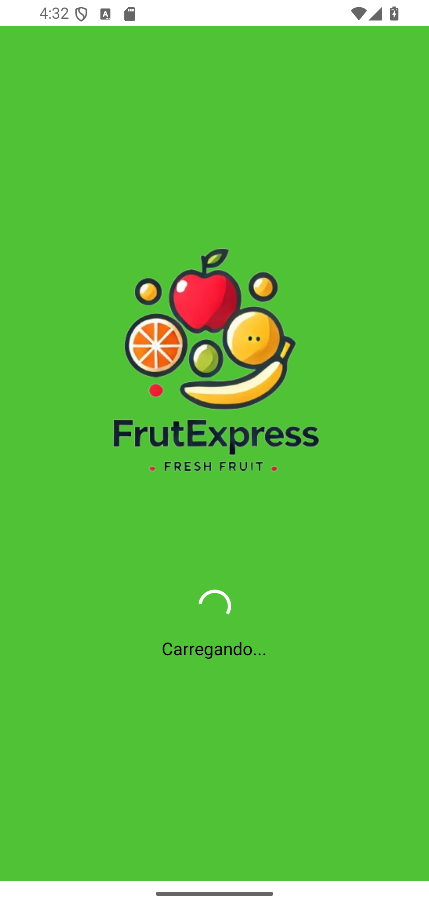
## 2. Tela de seleção entre usuario ou entregador
Done.
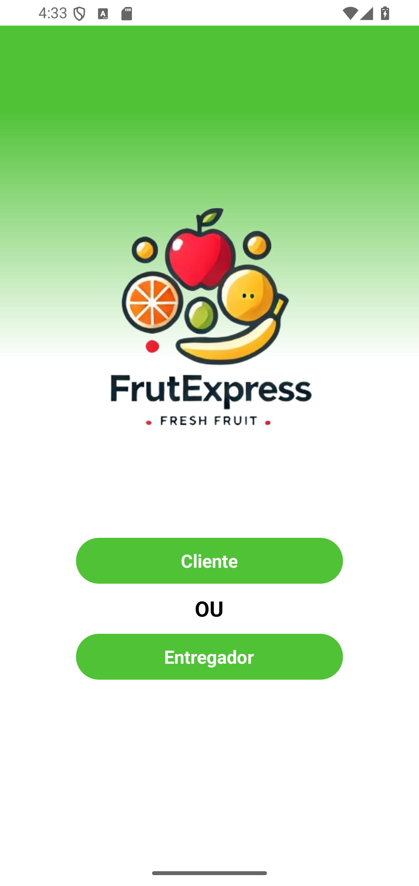
## 3. Tela de login
Done.
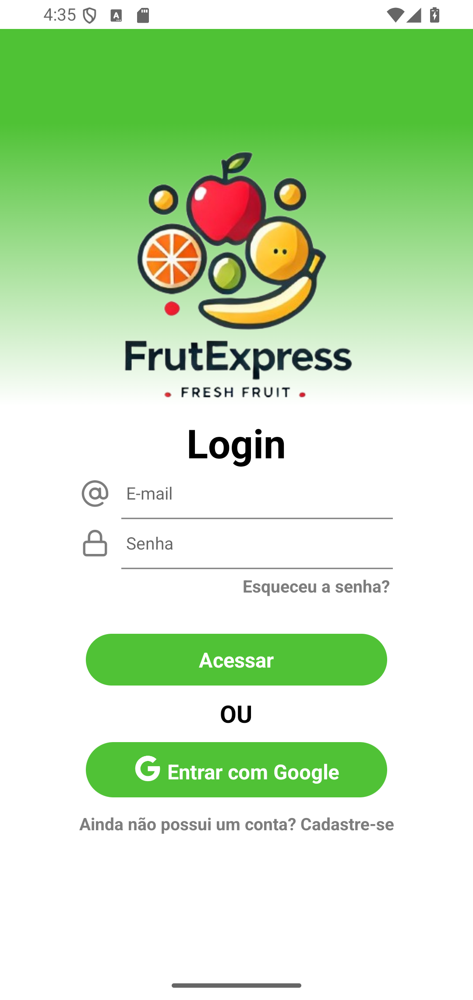
## 4. Tela de registre-se
Done.
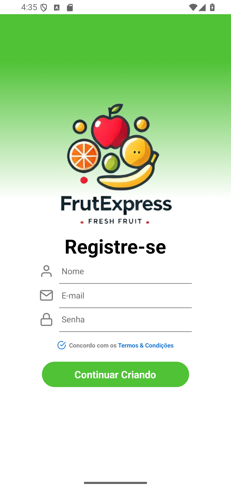
## 5. Tela de Continuar criando
Done.
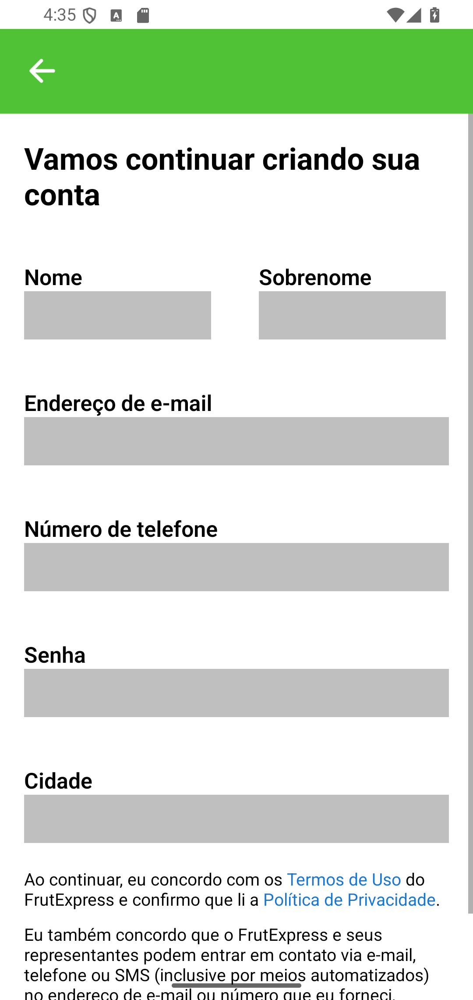
## 6. Olá, entregador
Done.
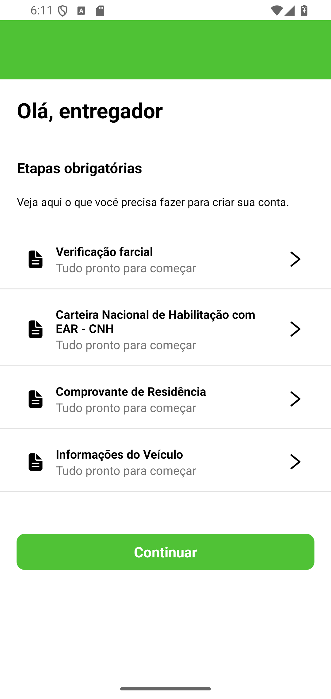
## 7. Tela de Tudo certo
Done.
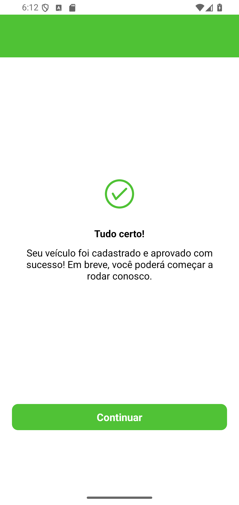

## 8. Home App
Done.
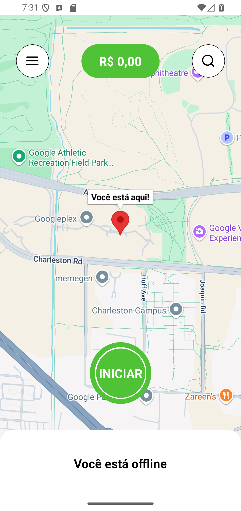

## 9. Menu lateral
Done.
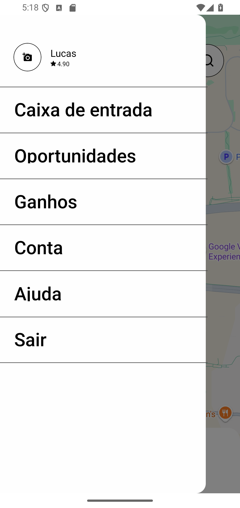

## 10. Perfil No App
Done.
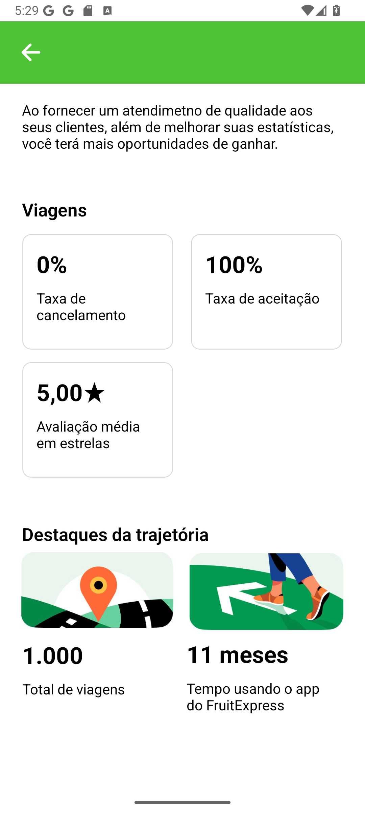

## 11. Caixa de entrada
Done.

## 12. Ganhos
Done.
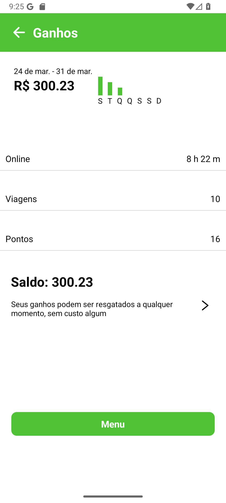

## 13. Carteira
Done.
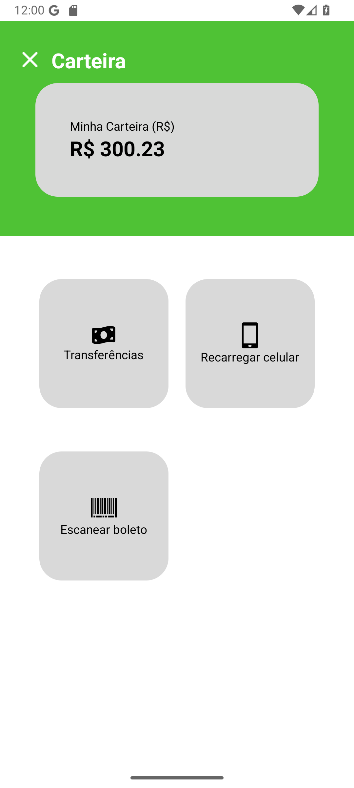

## 14. Enviar
Done.
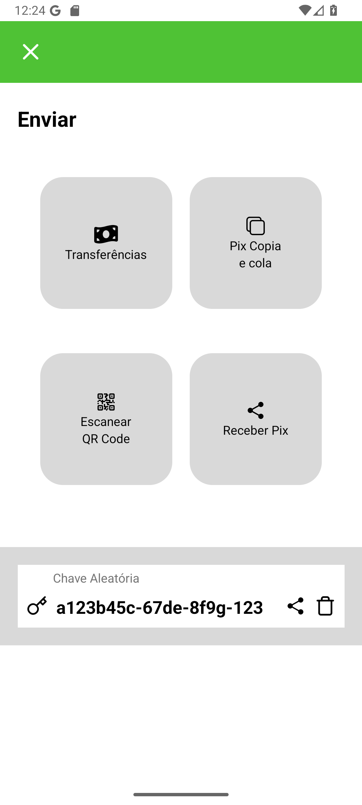

## 15. Destinatário
Done.
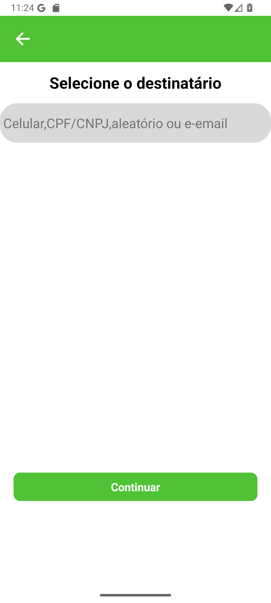

## 16. Valor
Done.
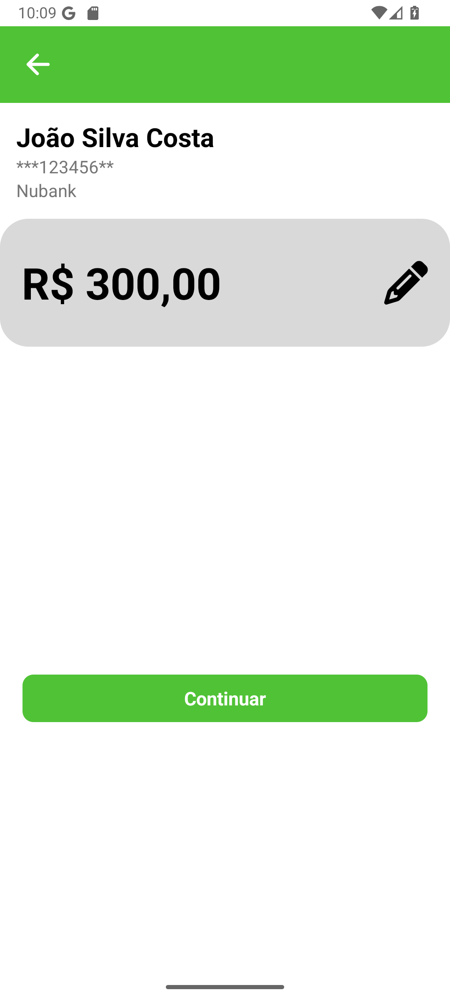

## 17. Valor Confirmar
Done.
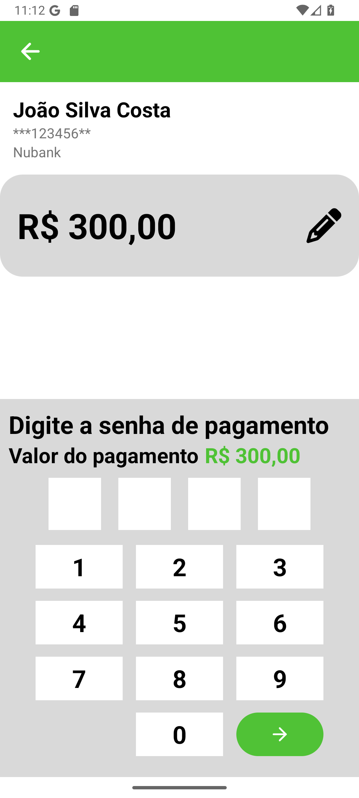

## 18. Comprovante de pagamento
Done.
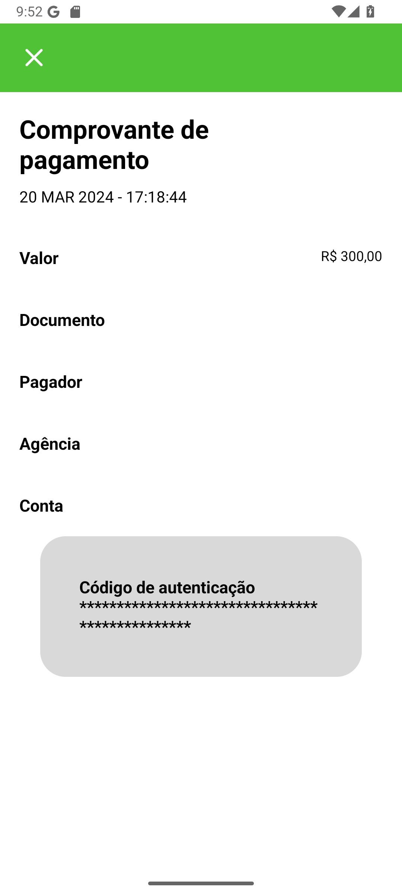

## 19. CNH
Done.
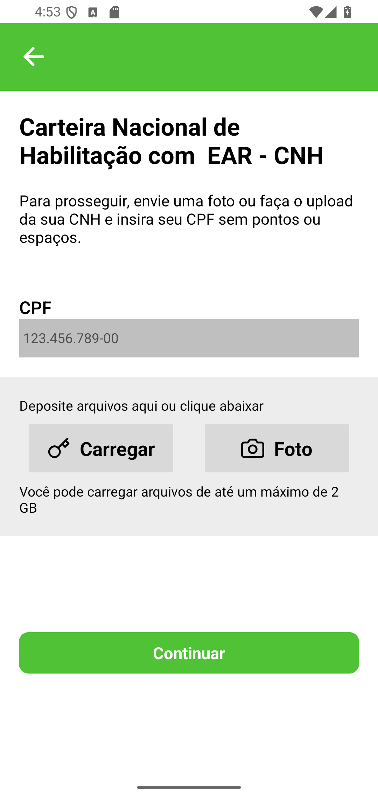

## 20. Documento
Done.
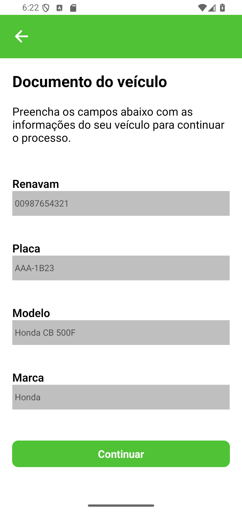